# Manual de Usuario - Administración del Sistema

## 1. Introducción

El módulo de Administración del Sistema es el centro de control para la seguridad y el acceso dentro de Tecmein. Permite a los usuarios autorizados (generalmente, administradores) gestionar quién puede ingresar al sistema y qué acciones puede realizar cada persona.

Una correcta configuración en este módulo es vital para proteger la información de la empresa y asegurar que los empleados solo tengan acceso a las funcionalidades relevantes para su puesto.

**Nota:** El acceso a este módulo está restringido a roles con privilegios de administrador.

## 2. Acceso al Módulo

Para acceder, el usuario debe navegar al menú de **Configuración** o **Administración** y seleccionar las sub-secciones correspondientes, como **Usuarios** o **Roles**.

## 3. Gestión de Usuarios

Esta sección permite administrar las cuentas de las personas que utilizan el sistema.

### 3.1. Pantalla Principal (Listado de Usuarios)

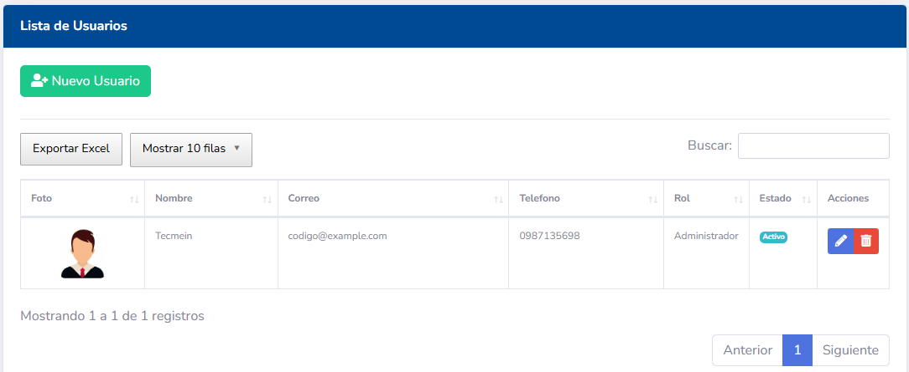

Muestra una lista de todos los usuarios registrados con detalles clave:
- **Nombre de Usuario:** Identificador de inicio de sesión.
- **Nombre Completo:** Nombre y apellido del usuario.
- **Correo Electrónico:** Email de contacto.
- **Rol Asignado:** El rol que define sus permisos.
- **Estado:** Indica si la cuenta está `Activa` o `Inactiva`.
- **Acciones:** Botones para Editar, Desactivar, etc.

### 3.2. Crear un Nuevo Usuario

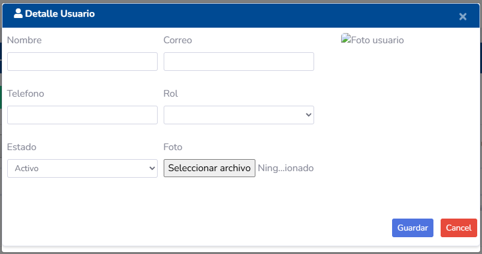
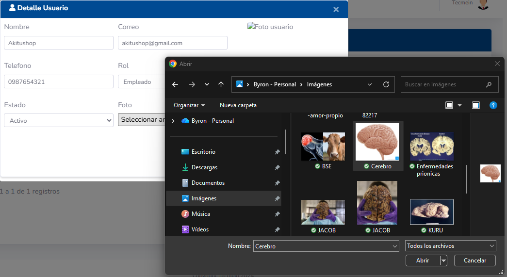

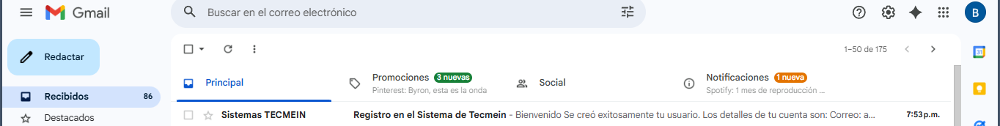
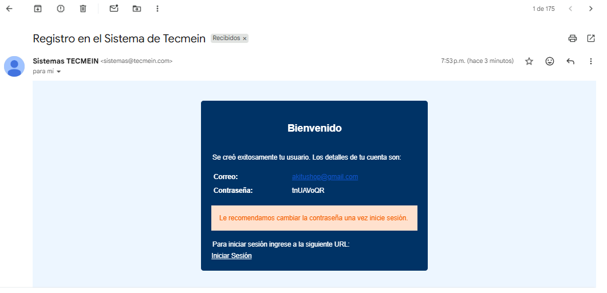
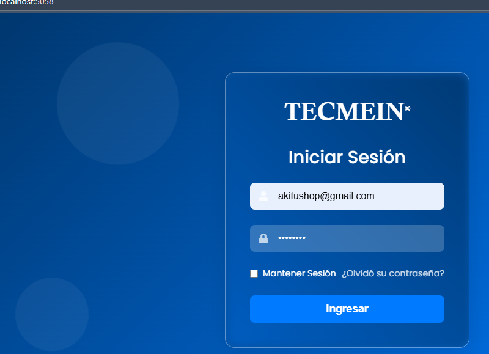

1.  Haga clic en el botón **"Nuevo Usuario"**.
2.  Complete el formulario con los datos del nuevo empleado:
    - **Nombre de Usuario:** (Ej: `j.perez`)
    - **Nombre Completo:** (Ej: `Juan Pérez`)
    - **Correo Electrónico:**
    - **Contraseña Temporal:** Asigne una contraseña inicial. El sistema debería forzar al usuario a cambiarla en su primer inicio de sesión.
    - **Rol:** Seleccione de la lista el rol que desempeñará (Ej: `Técnico`, `Vendedor`).
3.  Haga clic en **"Guardar"**.

### 3.3. Editar un Usuario

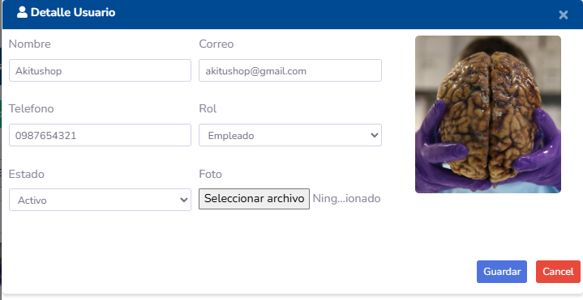

1.  Busque al usuario en el listado y haga clic en el icono de **Editar**.
2.  Podrá modificar su nombre, correo y reasignar su rol.
3.  **Restablecer Contraseña:** Dentro de la edición, suele existir un botón para generar una nueva contraseña temporal y enviarla al correo del usuario si la ha olvidado.

    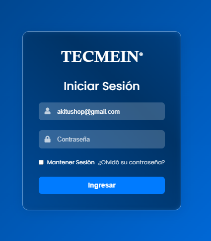
    
    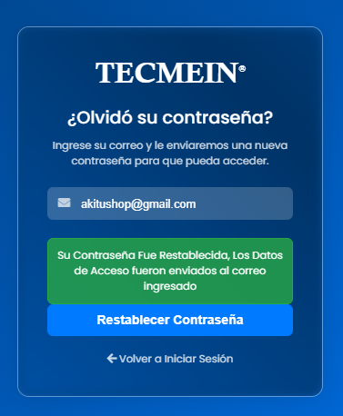
    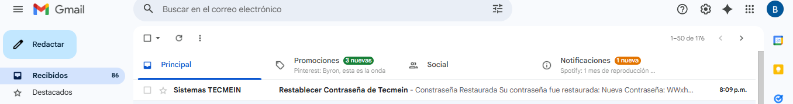
    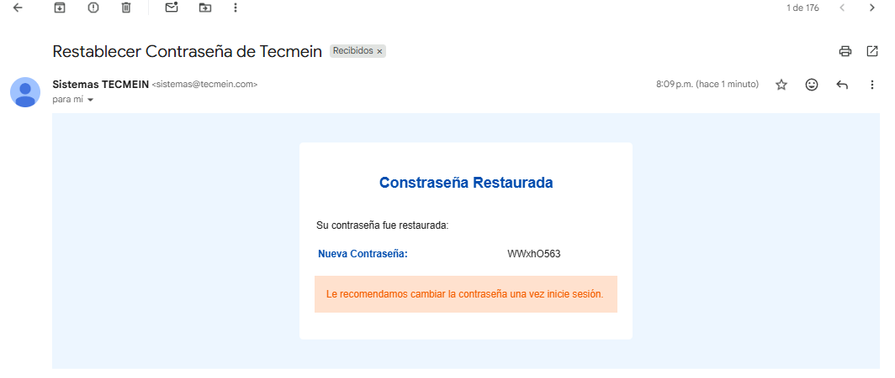

### 3.4. Activar / Desactivar un Usuario
En lugar de eliminar un usuario (lo que podría causar pérdida de historial), la mejor práctica es desactivarlo.
- Un usuario **inactivo** no puede iniciar sesión en el sistema, pero todos sus registros (visitas, contratos, etc.) se conservan.
- Esta acción se realiza normalmente con un botón o interruptor en la fila del usuario en el listado.

### 3.5. Perfil de Usuario

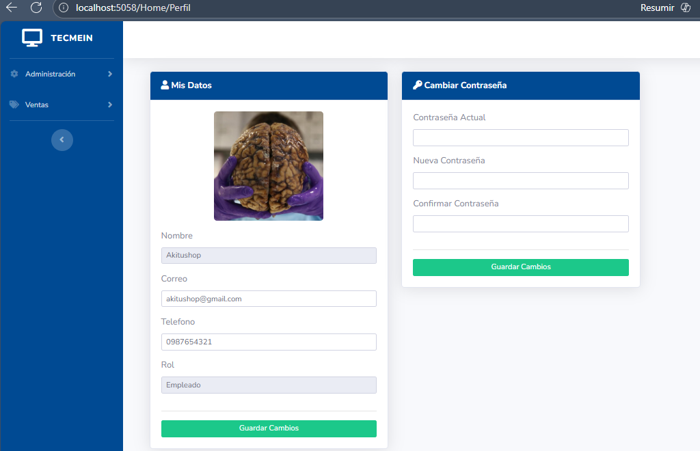
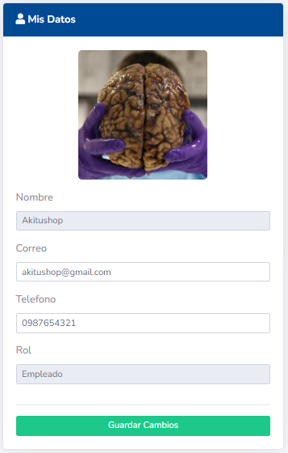
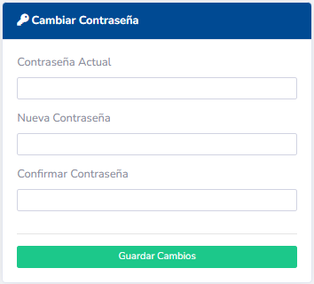
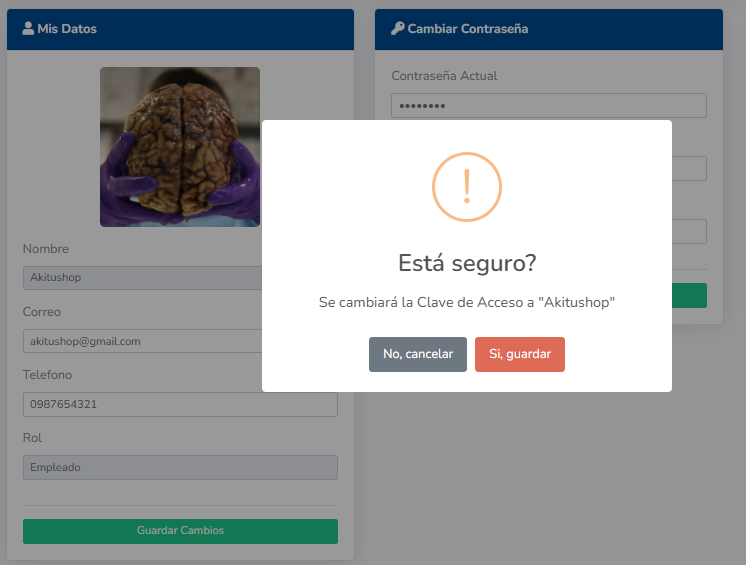
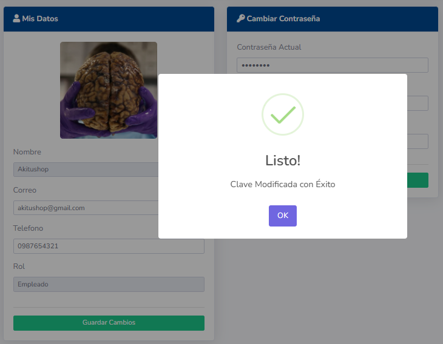

## 4. Gestión de Roles y Permisos

Esta es la sección más crítica, ya que define lo que cada tipo de usuario puede hacer.

### 4.1. Pantalla Principal (Listado de Roles)
Muestra los roles definidos en el sistema, como `Administrador`, `Jefe de Ventas`, `Técnico`, `Contabilidad`.

### 4.2. Crear un Nuevo Rol
1.  Haga clic en **"Nuevo Rol"**.
2.  Asigne un **Nombre** descriptivo (Ej: `Asistente Comercial`) y una **Descripción** de su propósito.
3.  Guarde el nuevo rol. Inicialmente, no tendrá ningún permiso.

### 4.3. Asignar Permisos a un Rol
1.  En el listado de roles, haga clic en el icono de **"Permisos"** o **"Editar"** junto al rol que desea configurar.
2.  Se presentará una pantalla con una lista de todos los permisos disponibles en el sistema, agrupados por módulo.

    

3.  **Ejemplo de Módulo "Visitas":**
    - `[ ] Ver Visitas Asignadas`
    - `[ ] Ver Todas las Visitas`
    - `[ ] Crear Nueva Visita`
    - `[ ] Editar Visita`
    - `[ ] Eliminar Visita`
    - `[ ] Avanzar Etapa de Visita`

4.  Marque las casillas correspondientes a las acciones que los usuarios con este rol podrán realizar.
5.  Haga clic en **"Guardar"** para aplicar la nueva configuración de permisos. Todos los usuarios con ese rol heredarán instantáneamente estos accesos.

## 5. Otras Configuraciones

### 5.1. Numeración de Clientes

### 5.2. Empresas

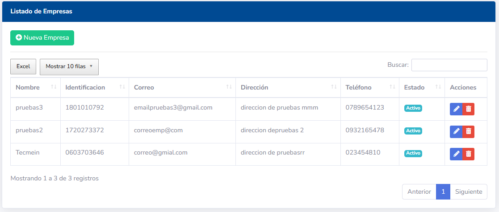
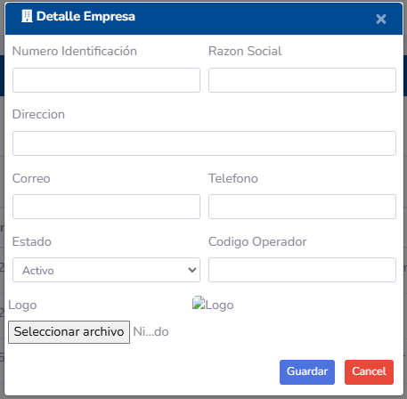
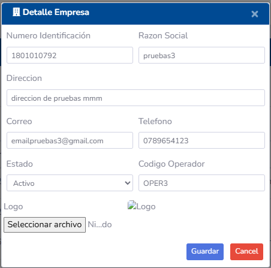

### 5.3. Impuestos

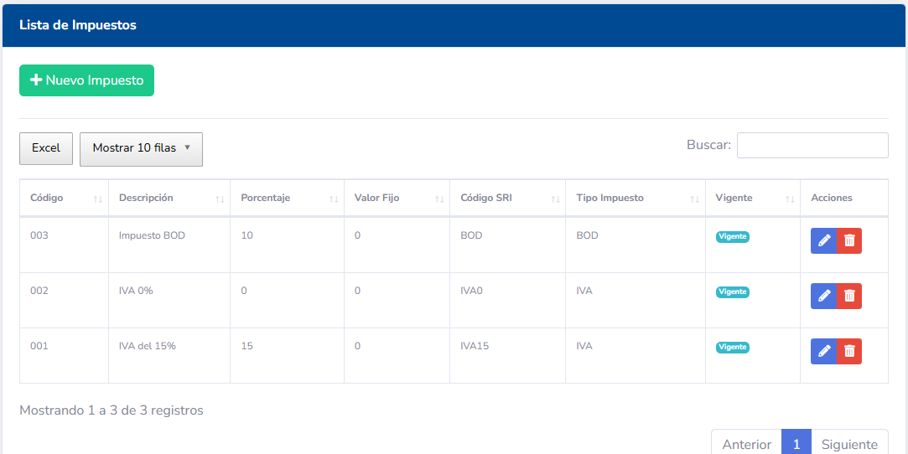
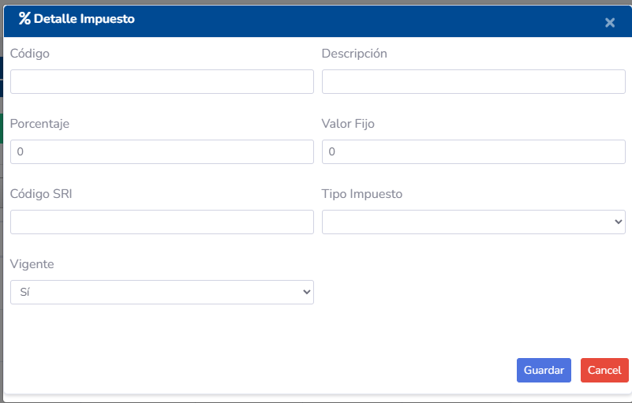
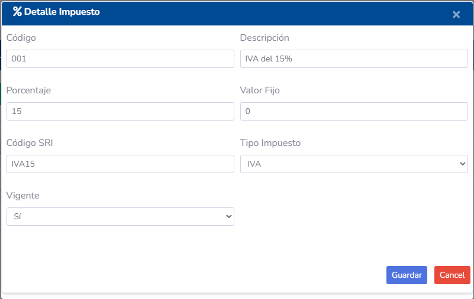

### 5.4. Formas de Pago

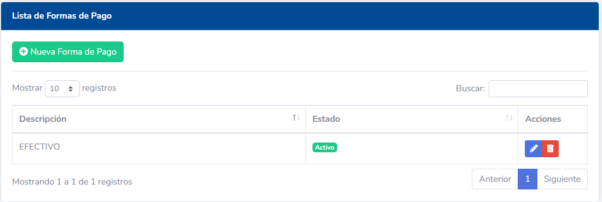
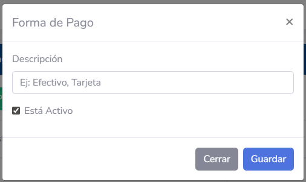

## 6. Flujo de Trabajo Recomendado

Para una configuración segura y ordenada, siga estos pasos:
1.  **Definir Roles:** Analice los puestos de trabajo en su empresa y cree un rol para cada uno.
2.  **Configurar Permisos:** Asigne los permisos mínimos necesarios para que cada rol pueda cumplir sus funciones (principio de menor privilegio).
3.  **Crear Usuarios:** Cree las cuentas de usuario y asígneles el rol pre-configurado que les corresponde.
4.  **Revisar Periódicamente:** Es una buena práctica revisar los permisos de cada rol de forma periódica para ajustarlos a las necesidades cambiantes del negocio.
