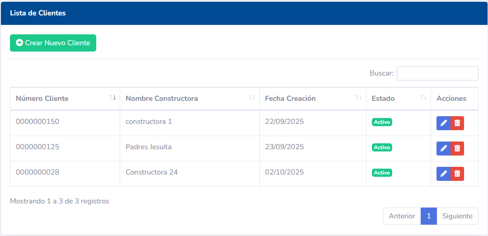
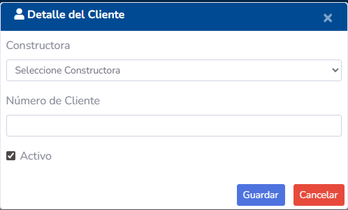
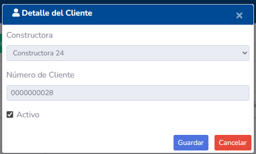
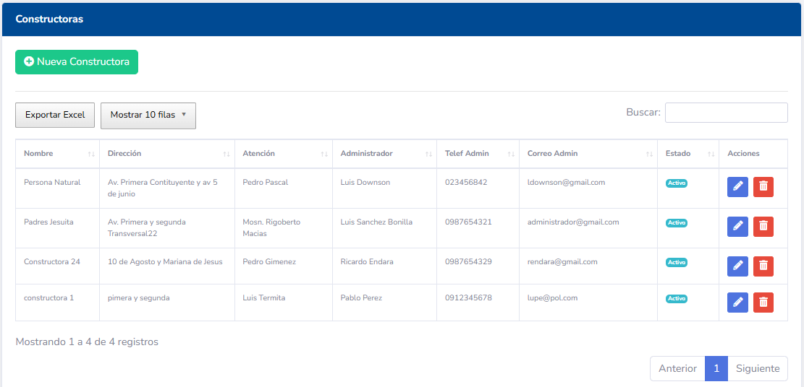
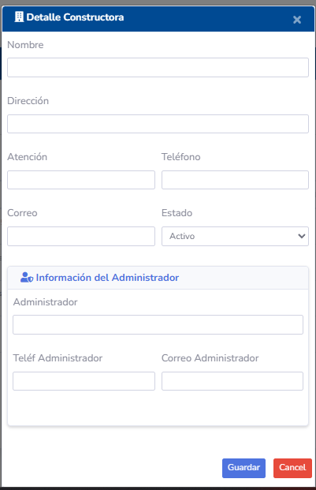
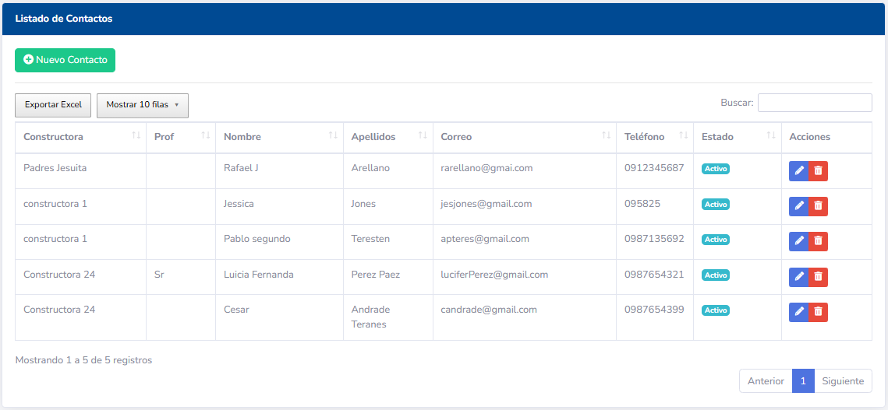
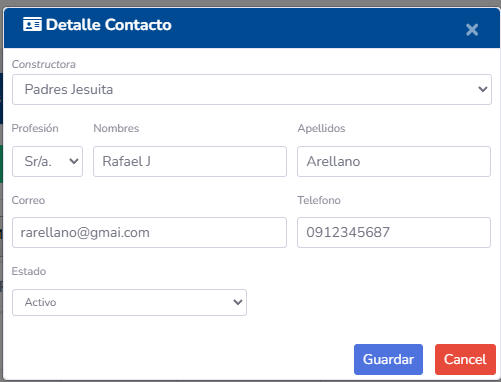

# Manual de Usuario - Gestión de Entidades Principales (Clientes, Constructoras, Contactos)

## 1. Introducción

Este módulo es el pilar fundamental del sistema Tecmein, ya que permite gestionar la información de las entidades clave con las que interactúa la empresa: Clientes, Constructoras (o Proyectos) y Contactos. La correcta administración de estos datos es esencial para el seguimiento comercial, la facturación y la comunicación.

## 2. Acceso a los Módulos

Cada tipo de entidad principal suele tener su propia sección en el menú principal del sistema, por ejemplo:
- **Clientes**
- **Constructoras / Proyectos**
- **Contactos**

## 3. Gestión de Clientes

La sección de Clientes permite administrar la información de las empresas o personas a las que Tecmein ofrece sus servicios.

### 3.1. Pantalla Principal (Listado de Clientes)

Muestra una tabla con todos los clientes registrados. Las columnas típicas incluyen:
- **RUC / Identificación:** Número de identificación fiscal o personal.
- **Razón Social / Nombre:** Nombre legal de la empresa o nombre completo de la persona.
- **Nombre Comercial:** Nombre por el que es conocido el cliente (si aplica).
- **Teléfono:** Número de contacto principal.
- **Correo Electrónico:** Dirección de correo principal.
- **Dirección:** Domicilio fiscal o principal.
- **Acciones:** Botones para Editar, Ver Detalles, etc.

### 3.2. Crear un Nuevo Cliente

1.  Haga clic en el botón **"Nuevo Cliente"**.
2.  Complete el formulario con la siguiente información:
    - **Tipo de Identificación:** (Ej: RUC, Cédula, Pasaporte).
    - **Número de Identificación:**
    - **Razón Social / Nombre:**
    - **Nombre Comercial:** (Opcional)
    - **Información de Contacto:** Teléfono, Correo Electrónico.
    - **Dirección:** Calle principal, número, referencia.
    - **Ubicación Geográfica:** Provincia, Cantón, Parroquia (seleccionando de listas desplegables).
3.  Haga clic en **"Guardar"**.

### 3.3. Editar un Cliente

1.  Localice el cliente en el listado y haga clic en el icono de **Editar**.
2.  Realice los cambios necesarios en el formulario.
3.  Haga clic en **"Guardar"** para actualizar la información.

### 3.4. Ver Detalles de Cliente
Haga clic en el icono de **Ver Detalles** para acceder a una vista completa del cliente, que puede incluir:
- Toda la información general.
- Un listado de las Constructoras/Proyectos asociados.
- Un listado de los Contactos asociados a este cliente.
- Historial de Visitas, Cotizaciones y Contratos relacionados.

## 4. Gestión de Constructoras / Proyectos

Esta sección permite administrar los proyectos específicos o las constructoras con las que trabaja un cliente. Una constructora o proyecto siempre estará asociado a un cliente principal.

### 4.1. Pantalla Principal (Listado de Constructoras/Proyectos)

Muestra una tabla con los proyectos o constructoras registrados. Las columnas típicas incluyen:
- **Nombre del Proyecto / Constructora:**
- **Cliente Asociado:** El cliente principal al que pertenece.
- **Dirección del Proyecto:** Ubicación física del proyecto.
- **Descripción:** Detalles adicionales del proyecto.
- **Acciones:** Botones para Editar, Ver Detalles, etc.

### 4.2. Crear una Nueva Constructora / Proyecto

1.  Haga clic en el botón **"Nueva Constructora / Proyecto"**.
2.  Complete el formulario:
    - **Nombre del Proyecto / Constructora:**
    - **Cliente Asociado:** Seleccione de una lista el cliente principal.
    - **Dirección del Proyecto:**
    - **Descripción:** (Opcional)
3.  Haga clic en **"Guardar"**.

### 4.3. Editar una Constructora / Proyecto

1.  Localice el proyecto en el listado y haga clic en el icono de **Editar**.
2.  Realice los cambios y haga clic en **"Guardar"**.

### 4.4. Ver Detalles de Constructora / Proyecto
Muestra toda la información del proyecto, incluyendo los contactos específicos asociados a este proyecto.

## 5. Gestión de Contactos

La sección de Contactos permite registrar a las personas clave dentro de las empresas clientes o constructoras.

### 5.1. Pantalla Principal (Listado de Contactos)

Muestra una tabla con todos los contactos registrados. Las columnas típicas incluyen:
- **Nombre Completo:**
- **Cargo:** Puesto que ocupa en la empresa.
- **Teléfono:** Número de contacto.
- **Correo Electrónico:**
- **Cliente Asociado:** La empresa principal a la que pertenece el contacto.
- **Constructora / Proyecto Asociado:** (Opcional) Si el contacto está ligado a un proyecto específico.
- **Acciones:** Botones para Editar, Ver Detalles, etc.

### 5.2. Crear un Nuevo Contacto

1.  Haga clic en el botón **"Nuevo Contacto"**.
2.  Complete el formulario:
    - **Nombre y Apellido:**
    - **Cargo:**
    - **Información de Contacto:** Teléfono, Correo Electrónico.
    - **Cliente Asociado:** Seleccione el cliente principal.
    - **Constructora / Proyecto Asociado:** (Opcional) Si selecciona un cliente, se habilitará una lista para elegir un proyecto de ese cliente.
3.  Haga clic en **"Guardar"**.

### 5.3. Editar un Contacto

1.  Localice el contacto en el listado y haga clic en el icono de **Editar**.
2.  Realice los cambios y haga clic en **"Guardar"**.

### 5.4. Ver Detalles de Contacto
Muestra toda la información del contacto, incluyendo a qué cliente y/o proyecto está asociado.

## 6. Relaciones entre Entidades

Es importante entender cómo estas entidades se relacionan:
- Un **Cliente** puede tener múltiples **Constructoras/Proyectos**.
- Un **Cliente** puede tener múltiples **Contactos**.
- Una **Constructora/Proyecto** siempre pertenece a un **Cliente**.
- Un **Contacto** puede estar asociado a un **Cliente** o a una **Constructora/Proyecto** específica.

Estas relaciones son fundamentales para la trazabilidad y la organización de la información comercial.

## 7. Permisos y Roles

El acceso y las acciones permitidas en estos módulos están controlados por los roles y permisos del usuario:
- **Vendedor/Comercial:** Generalmente puede crear, editar y ver clientes, constructoras y contactos.
- **Administrador:** Acceso completo a todas las funcionalidades.
- **Consulta:** Solo puede ver la información, sin capacidad de modificarla.
