# Manual de Usuario - Gestión de Pre-Contratos y Contratos

## 1. Introducción

Este módulo es fundamental para formalizar los acuerdos comerciales con los clientes, transformando una cotización aprobada en un compromiso legalmente vinculante. Se divide en dos fases principales: el **Pre-Contrato** (una etapa flexible de negociación y definición de compromisos) y el **Contrato** (el documento final y definitivo).

## 2. Acceso a los Módulos

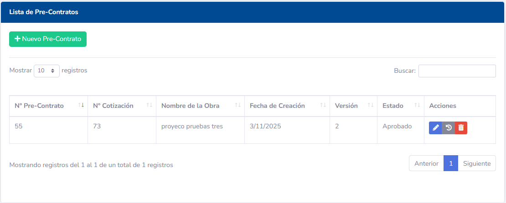

Los módulos de Pre-Contratos y Contratos se encuentran generalmente en el menú principal del sistema, bajo opciones como **"Pre-Contratos"** y **"Contratos"**.

## 3. Proceso de Pre-Contrato

El Pre-Contrato es un documento intermedio que permite definir y negociar los términos del acuerdo, especialmente el plan de pagos, antes de la emisión del contrato final.

### 3.1. Creación de un Pre-Contrato

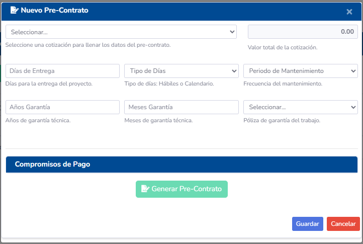
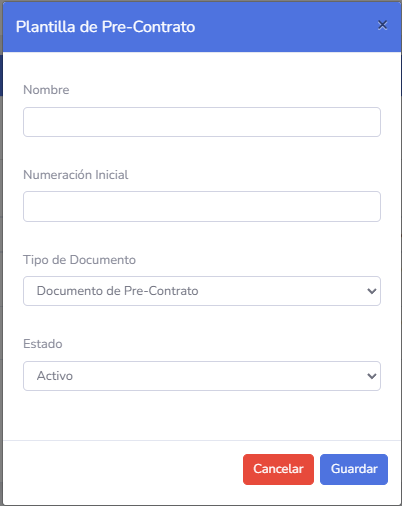
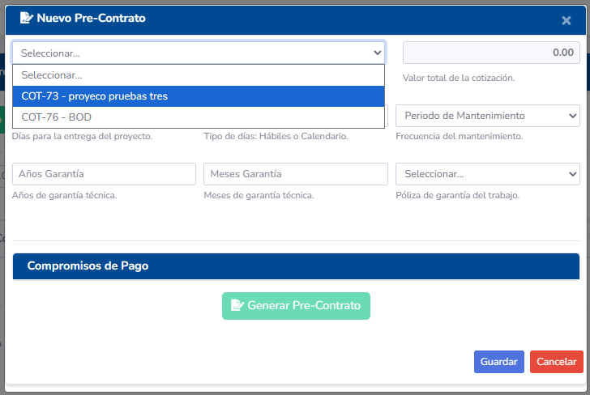
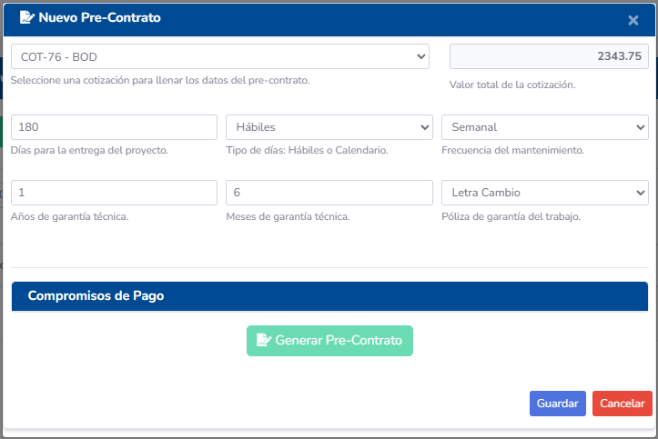
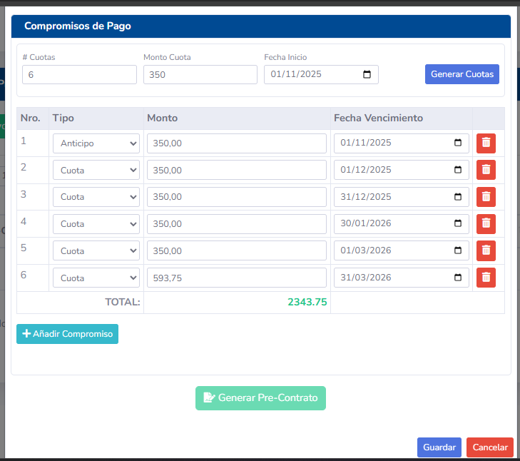
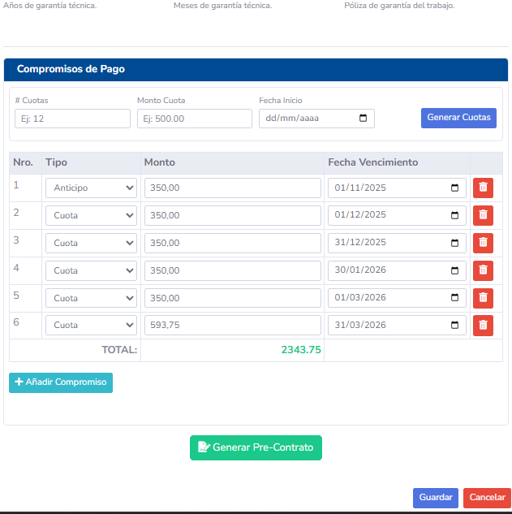

1.  **Desde una Cotización Aprobada:** La forma más común de iniciar un Pre-Contrato es desde una Cotización que ha sido marcada como `Aprobada`. En la vista de detalles de la cotización, busque un botón como **"Generar Pre-Contrato"**.
2.  **Selección de Plantilla:** El sistema le pedirá seleccionar una `Plantilla de Pre-Contrato` predefinida. Estas plantillas contienen la estructura y el texto base del acuerdo.
3.  **Datos Iniciales:** El Pre-Contrato se precargará con información del cliente, proyecto y los montos de la cotización aprobada.
4.  **Definición de Compromisos de Pago (Plan Flexible):**
    - Esta es una sección clave del Pre-Contrato. Aquí podrá definir las cuotas y fechas de pago de manera flexible, adaptándose a las necesidades del cliente.
    - Podrá agregar, modificar o eliminar cuotas, especificando el monto y la fecha de vencimiento de cada una.
    - El sistema calculará el total de los compromisos de pago para asegurar que coincida con el monto total del Pre-Contrato.
5.  **Revisión y Edición:** Revise el contenido del Pre-Contrato, ajustando cualquier párrafo o condición específica que no esté en la plantilla.
6.  **Guardar como Borrador:** Guarde el Pre-Contrato en estado `Borrador` para continuar trabajando en él o para enviarlo a revisión interna.

### 3.2. Edición y Versionado de Pre-Contratos
- Los Pre-Contratos en estado `Borrador` pueden ser editados libremente.
- Si se realizan cambios significativos en un Pre-Contrato que ya ha sido enviado a revisión o al cliente, es recomendable **crear una nueva versión**. Esto asegura un historial claro de las negociaciones y evita confusiones. La versión anterior se mantendrá intacta.

### 3.3. Aprobación del Pre-Contrato

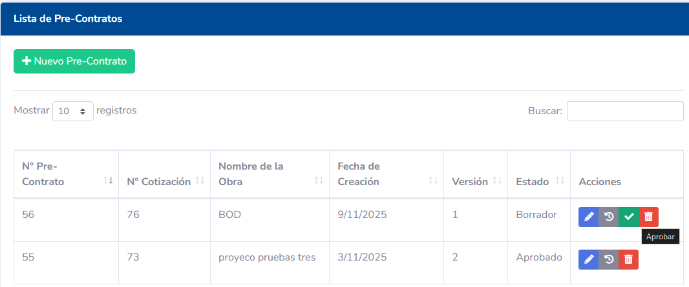
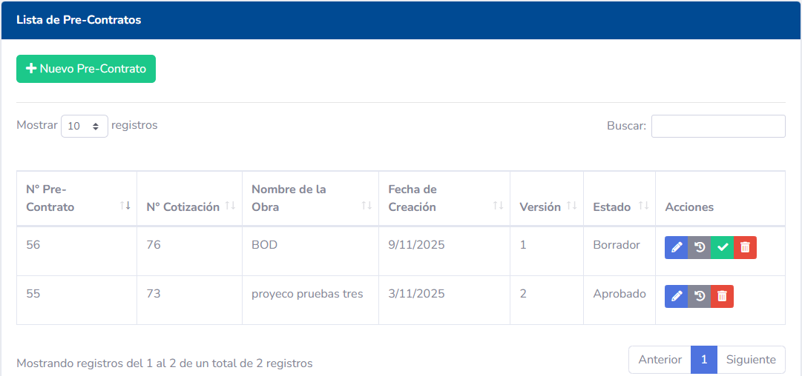

Una vez que el Pre-Contrato ha sido negociado y acordado con el cliente, y ha pasado por cualquier revisión interna necesaria:
1.  Haga clic en el botón **"Aprobar Pre-Contrato"**.
2.  Esta acción es irreversible y tiene consecuencias importantes:
    - El Pre-Contrato pasa a un estado `Aprobado` y se vuelve de solo lectura.
    - El plan de pagos flexible definido en el Pre-Contrato se **finaliza** y se utiliza como base para generar el `PlanDePago` y las `Cuotas` definitivas del Contrato.

## 4. Proceso de Contrato

El Contrato es el documento final que formaliza el acuerdo.

### 4.1. Generación del Contrato Final

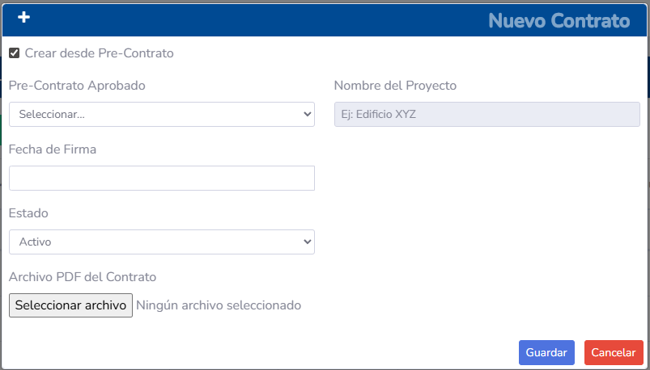
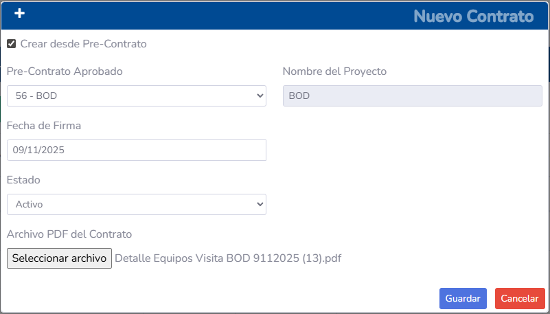
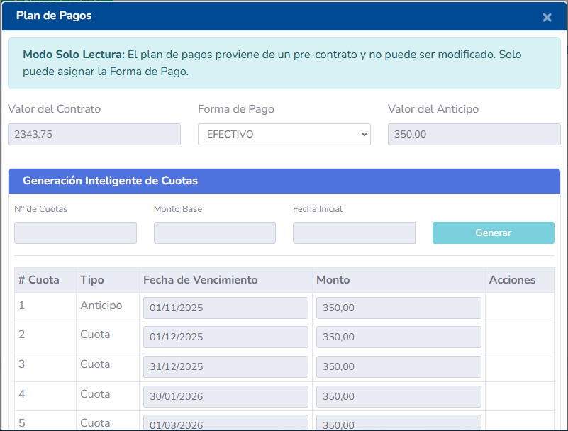
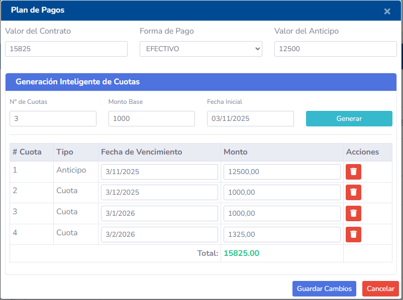

1.  **Desde un Pre-Contrato Aprobado:** Una vez que un Pre-Contrato ha sido `Aprobado`, aparecerá un botón como **"Generar Contrato"**.
2.  Al hacer clic, el sistema tomará toda la información del Pre-Contrato aprobado (incluyendo el plan de pagos final) y generará el `Contrato` definitivo.
3.  El Contrato generado es un documento de solo lectura que representa el acuerdo final.

### 4.2. Gestión de Cuotas y Pagos
- Cada Contrato tendrá asociado un `PlanDePago` detallado, con las `Cuotas` generadas a partir del Pre-Contrato aprobado.
- **Visualización de Cuotas:** En la vista de detalles del Contrato, podrá ver el listado de cuotas, sus montos, fechas de vencimiento y estado (Ej: `Pendiente`, `Pagada`, `Vencida`).
- **Registro de Pagos:** Cuando un cliente realice un pago, se deberá registrar en el sistema, asociándolo a la cuota correspondiente. Esto actualizará el estado de la cuota a `Pagada` y el saldo pendiente del Contrato.

### 4.3. Pólizas de Garantía
Si el Contrato requiere una `PolizaGarantia`, esta sección permitirá registrar y asociar los detalles de la póliza (número, fecha de emisión, fecha de vencimiento, monto) al Contrato correspondiente.

## 5. Plantillas de Documentos

El sistema utiliza `PlantillaPreContrato` y `PlantillaPreContratoParrafo` para estandarizar la creación de estos documentos. Los administradores pueden gestionar y actualizar estas plantillas para asegurar que los documentos generados cumplan con los requisitos legales y comerciales de la empresa.

## 6. Permisos y Roles
- **Vendedor/Comercial:** Puede crear y editar Pre-Contratos, proponer planes de pago flexibles.
- **Jefe de Ventas/Gerencia:** Tiene permisos para revisar y `Aprobar Pre-Contratos`, y para `Generar Contratos` finales.
- **Contabilidad:** Acceso para registrar `Pagos` y gestionar el estado de las `Cuotas`.
- **Administrador:** Acceso completo a la gestión de Pre-Contratos, Contratos, Cuotas, Pagos y la administración de Plantillas.
