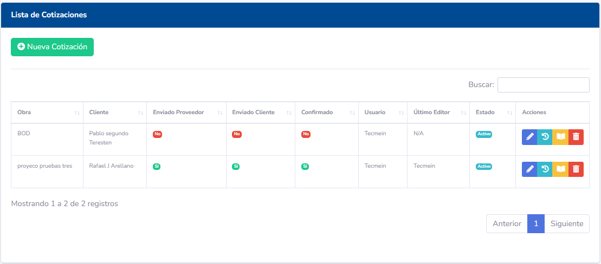
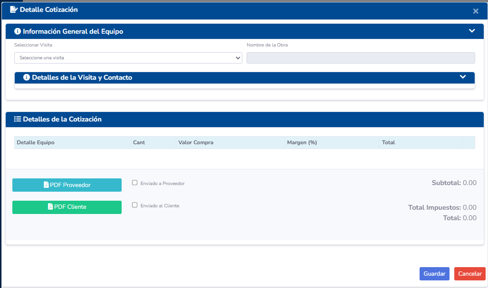
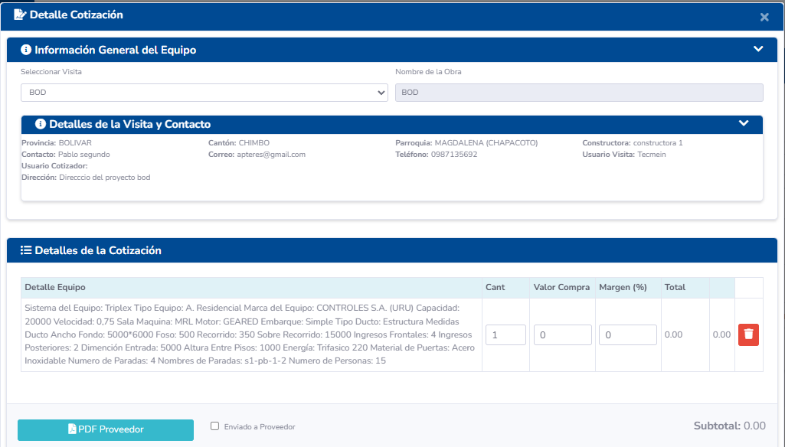
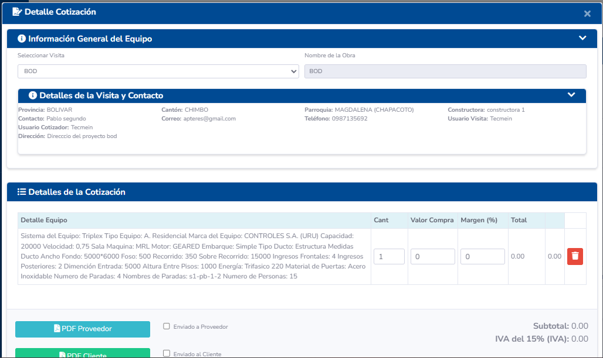
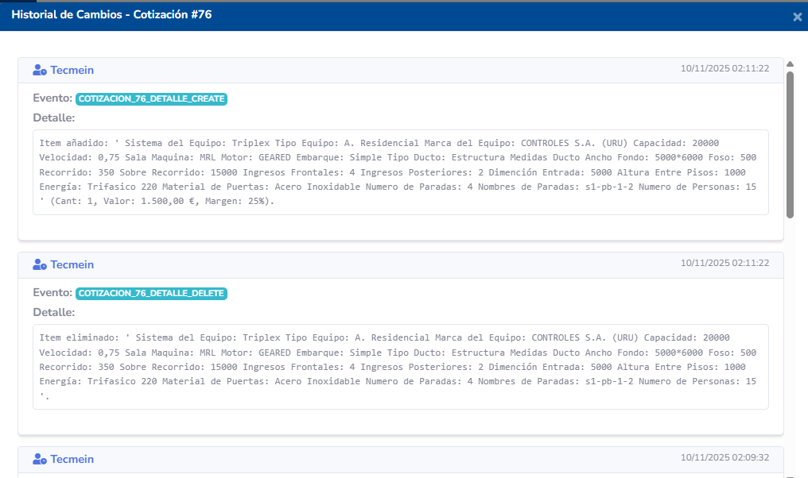
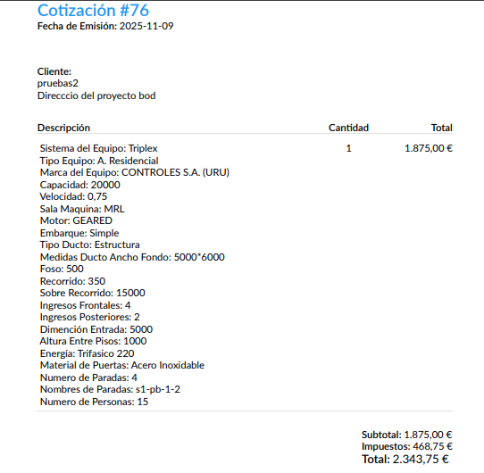
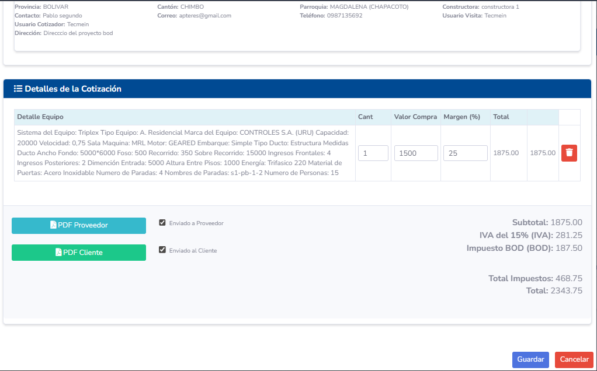
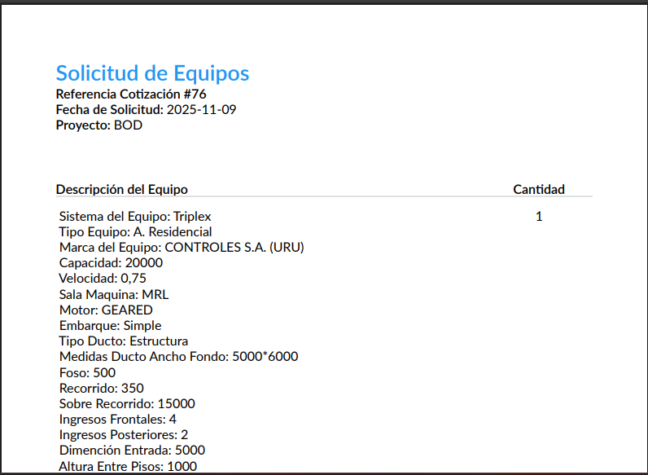

# Manual de Usuario - Proceso de Cotización

## 1. Introducción

El módulo de Cotizaciones es una pieza clave del proceso de ventas en Tecmein. Permite la creación, gestión y seguimiento de ofertas comerciales formales para los clientes. A través de este módulo, se detallan los productos y servicios, sus costos, y se mantiene un registro histórico de las negociaciones.

Las cotizaciones suelen ser el paso siguiente a una visita técnica o un contacto comercial inicial.

## 2. Acceso al Módulo

Para gestionar las cotizaciones, el usuario debe seleccionar la opción **Cotizaciones** en el menú principal del sistema.

## 3. Pantalla Principal (Listado de Cotizaciones)

Esta pantalla muestra un resumen de todas las cotizaciones y permite un acceso rápido a sus detalles y acciones.

Columnas principales del listado:
- **Número Cotización:** Código único que identifica la oferta.
- **Versión:** Número de versión de la cotización (v1, v2, etc.).
- **Cliente/Proyecto:** Entidad a la que se dirige la oferta.
- **Fecha de Emisión:** Día en que se generó la cotización.
- **Monto Total:** Valor total de la oferta, incluyendo impuestos.
- **Estado:** El estado actual dentro del flujo de trabajo (Ej: `Borrador`, `Enviada`, `Aprobada`, `Rechazada`).
- **Acciones:** Botones para interactuar con cada cotización.

## 4. Creación y Gestión de una Cotización

### 4.1. Iniciar una Nueva Cotización

1.  Haga clic en el botón **"Nueva Cotización"**.
2.  Se abrirá el formulario para los datos generales de la cotización:
    - **Cliente y Proyecto:** Seleccione el cliente y, si aplica, el proyecto o constructora.
    - **Asociar Visita (Opcional):** Puede vincular la cotización a una visita técnica previa para mantener la trazabilidad.
    - **Información Comercial:** Complete campos como `Validez de la oferta`, `Forma de Pago` sugerida y `Tiempo de Entrega` estimado.
3.  Guarde esta cabecera. El sistema creará la cotización en estado `Borrador` y le asignará un número.

### 4.2. Agregar Productos y Servicios (Detalle)

Una vez creada la cabecera, el siguiente paso es añadir los ítems:
1.  Dentro de la vista de edición de la cotización, busque la sección de "Detalles" y haga clic en **"Agregar Producto/Servicio"**.
2.  Se abrirá una ventana para buscar y seleccionar ítems del catálogo de productos/servicios de la empresa.
3.  Para cada ítem, especifique:
    - **Cantidad:** Número de unidades.
    - **Precio Unitario:** El sistema puede sugerir un precio de lista, pero usualmente es editable.
    - **Descuento:** Aplique un descuento si es necesario (en porcentaje o valor).
4.  El sistema calculará automáticamente el subtotal por cada línea.

### 4.3. Cálculo de Totales e Impuestos
- **Subtotal:** Suma de todos los ítems antes de impuestos.
- **Impuestos:** El sistema aplicará los impuestos configurados (ej. IVA 12%) sobre el subtotal.
- **Total:** El monto final que el cliente deberá pagar.

## 5. Versionado de Cotizaciones

El versionado es crucial para mantener un historial claro de las negociaciones.

### 5.1. ¿Cuándo crear una nueva versión?
Si un cliente solicita un cambio en una cotización que ya fue enviada (cambiar cantidades, precios, agregar o quitar ítems), no se debe modificar la original. En su lugar, se crea una nueva versión.

### 5.2. Proceso para Versionar
1.  Localice la cotización enviada en el listado.
2.  En el menú de "Acciones", seleccione la opción **"Crear Nueva Versión"** o **"Versionar"**.
3.  El sistema creará una copia exacta de la cotización, pero incrementará el número de versión (ej. de `v1` a `v2`). La versión anterior se preservará con su estado original (ej. `Enviada`).
4.  Ahora puede editar la nueva versión (`v2`) para reflejar los cambios solicitados por el cliente.

## 6. Flujo de Aprobación y Estados

Una cotización pasa por varios estados a lo largo de su ciclo de vida:

1.  **Borrador:** La cotización está siendo creada o editada. No es visible para el cliente.
2.  **Enviada:** La cotización ha sido finalizada y enviada al cliente. Para formalizar este paso, se utiliza un botón **"Generar PDF y Enviar"**. Esto bloquea la cotización para evitar modificaciones y la marca como `Enviada`.

    
    
    

3.  **Aprobada:** Si el cliente acepta la oferta, el usuario debe registrar esta decisión en el sistema. Se utiliza un botón **"Marcar como Aprobada"**. Este estado es a menudo el disparador para el siguiente paso del proceso comercial: la creación de un **Pre-Contrato** o Contrato.
4.  **Rechazada:** Si el cliente no acepta la oferta, se debe marcar como **"Rechazada"**. Esto saca la cotización del flujo de trabajo activo, pero la mantiene en el historial.
5.  **Anulada:** Un estado para invalidar una cotización por motivos internos, incluso si ya había sido enviada.

## 7. Permisos y Roles
- **Vendedor/Comercial:** Puede crear, editar y versionar las cotizaciones de los clientes a su cargo.
- **Jefe de Ventas:** Tiene visibilidad sobre todas las cotizaciones, puede editarlas y es posible que sea el único con permiso para aplicar descuentos especiales o aprobar ciertas ofertas.
- **Administrador:** Acceso total al módulo.
